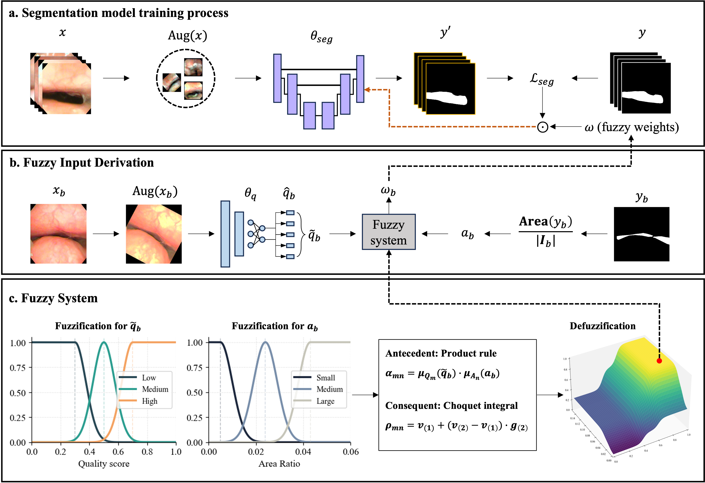

# Fuzzy Adaptive Loss Based on Quality and Region Weighting for Medical Image Segmentation

Reference implementation of the Choquet-based fuzzy adaptive loss for airway segmentation on
drug-induced sleep endoscopy (DISE) images.

**Paper:** Shang-Lin Chung, Pei-Chen Huang, Yun-Ting Lee, Yen-Hsun Li, Wei-Chun Chen, Ying-Shuo Hsu, I-Fang Chung.
*Fuzzy Adaptive Loss Based on Quality and Region Weighting for Medical Image Segmentation.*
International Journal of Fuzzy Systems.
DOI: [10.1007/s40815-026-02334-8](https://doi.org/10.1007/s40815-026-02334-8)



Each training image gets an adaptive weight `ω` from two cues: the quality score predicted by a frozen
quality model, and the area ratio of the annotated airway. Both are fuzzified into linguistic terms,
combined by a 9-rule base whose singleton consequents are built with a second-order Choquet integral,
and defuzzified by a center-average defuzzifier. The resulting weight modulates the per-image
segmentation loss, `L = ω · L_seg`.

## Repository layout

```
config.py            all hyperparameters: PATHs, model, training, fuzzy parameters, augmentation
train.py             training / validation / test loop
utils/fuzzy.py       membership functions, Choquet consequents, defuzzification
utils/loss.py        Dice / BCE base loss and fuzzy-weighted loss
utils/dataset.py     DISE dataset and dataloaders
utils/qmodel.py      five-class image quality model (frozen during segmentation training)
utils/metrics.py     Dice, IoU, precision, recall
utils/preprocessing.py  augmentation operators
```

## Installation

```bash
pip install -r requirements.txt
```

## Data

Images are paired with LabelMe polygon annotations. Airway polygons are the shapes labeled
`V_airway`, `O_airway`, or `OTE`. Each split directory follows:

```
data/train/
  <case_id>/
    jpg/   frame_0001.jpg ...
    json/  frame_0001.json ...
```

`data/valid/` and `data/test/` use the same structure.

## Usage

1. Set the paths in `config.py`:

```python
TRAIN_PATH         = './data/train/'
VALID_PATH         = './data/valid/'
TEST_PATH          = './data/test/'
QUALITY_MODEL_PATH = './weights/quality_model.pth'
SAVE_PATH          = './results/'
```

2. Choose the loss and weighting scheme:

```python
LOSS_TYPE     = 'dice'      # dice, bce
WEIGHT_MODE   = 'choquet'   # choquet (ours), linear (baseline), none (unweighted)
LINEAR_LAMBDA = 0.6         # linear baseline: ω = λ·q + (1-λ)·a
```

3. Train:

```bash
python train.py
```

The run writes to `SAVE_PATH/<timestamp>-<backbone>-<structure>-<loss>-<weight_mode>/`:
per-epoch metrics in `training_info.csv`, the best-validation-Dice checkpoint in `weights/best.pth`,
and the metrics of that checkpoint on the test split in `test_result.csv`.

## Fuzzy parameters

All fuzzy settings live in `config.py` and follow the paper:

| Parameter | Value | Meaning |
| --- | --- | --- |
| `Q_LOW_MU`, `Q_MEDIUM_MU`, `Q_HIGH_MU` | 0.3, 0.5, 0.7 | quality membership centers |
| `Q_SIGMA` | 0.075 | quality membership spread |
| `A_SMALL_MU`, `A_MEDIUM_MU`, `A_LARGE_MU` | 0.005, 0.024, 0.043 | area ratio membership centers |
| `A_SIGMA` | 0.01 | area ratio membership spread |
| `ETA` | 0.6 | density mass allocated to the quality cue |
| `SCALE` | 0.6 | overall density magnitude (`g_q = 0.36`, `g_a = 0.24`) |
| `PROTOTYPES` | 0.001, 0.5, 1.0 | negligible / moderate / strong semantic contribution |

With these settings `utils/fuzzy.py` reproduces the rule consequents reported in the paper:

| | Small | Medium | Large |
| --- | --- | --- | --- |
| **Low** | 0.001 | 0.121 | 0.241 |
| **Medium** | 0.181 | 0.500 | 0.620 |
| **High** | 0.361 | 0.680 | 1.000 |

## Training configuration

U-Net with an ImageNet-pretrained EfficientNet-B2 encoder, 224×224 inputs, Adam at 2e-4,
batch size 8, 50 epochs, cosine annealing. The quality model is loaded from
`QUALITY_MODEL_PATH` and kept frozen; only its predicted five-level distribution is used.

This repository contains the single-run training pipeline. Results in the paper are reported over a
patient-level 5×5 repeated cross-validation; to reproduce them, run `train.py` once per fold with the
`PATH` entries pointing at that fold's splits and average the per-fold `test_result.csv`.

## Citation

```bibtex
@article{Chung2026FuzzyAdaptiveLoss,
  title   = {Fuzzy Adaptive Loss Based on Quality and Region Weighting for Medical Image Segmentation},
  author  = {Chung, Shang-Lin and Huang, Pei-Chen and Lee, Yun-Ting and Li, Yen-Hsun and Chen, Wei-Chun and Hsu, Ying-Shuo and Chung, I-Fang},
  journal = {International Journal of Fuzzy Systems},
  year    = {2026},
  doi     = {10.1007/s40815-026-02334-8}
}
```

## Data availability

The DISE dataset contains clinical patient recordings and is not publicly released.
The study was approved by the Institutional Review Board under protocol number 20221213R.
